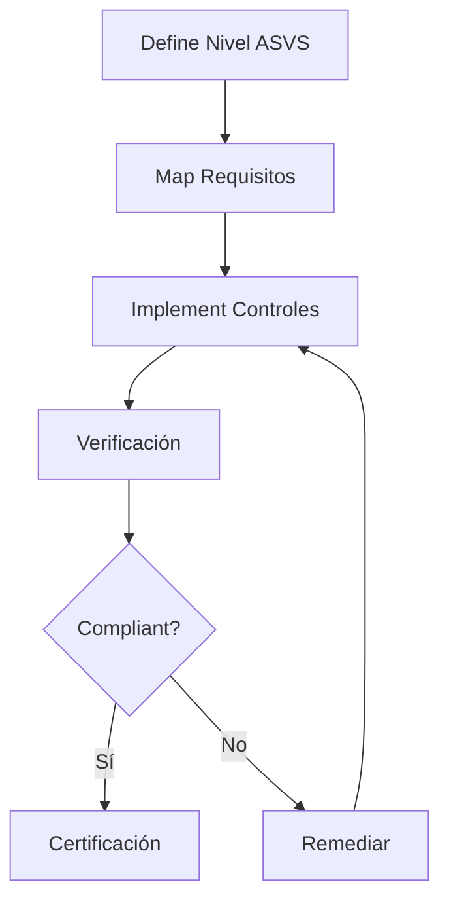
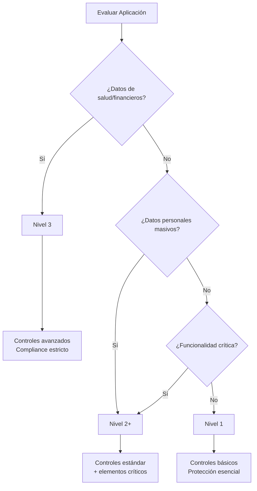

# Examen de Puesta en Producción Segura - Unidad 1

## Preguntas del Examen

### Pregunta 1
¿Qué significa que un lenguaje de programación tenga tipado débil? Pon un ejemplo de lenguaje de programación que tenga esta característica

### Pregunta 2
¿Qué significa que un lenguaje de programación tenga tipado fuerte? Pon un ejemplo de lenguaje de programación que tenga esta característica

### Pregunta 3
¿Qué significa que un lenguaje de programación tenga tipado estático? Pon un ejemplo de lenguaje de programación que tenga esta característica

### Pregunta 4
¿Qué significa que un lenguaje de programación tenga tipado dinámico? Pon un ejemplo de lenguaje de programación que tenga esta característica

### Pregunta 5
¿Qué significa que un lenguaje de programación sea interpretado? Pon un ejemplo de lenguaje de programación que tenga esta característica

### Pregunta 6
¿Qué significa que un lenguaje de programación sea compilado? Pon un ejemplo de lenguaje de programación que tenga esta característica

### Pregunta 7
Clasifica al lenguaje de programación Java atendiendo a todas las características de las preguntas anteriores.

### Pregunta 8
```
Commit inicial: C0 (main)
Creamos rama bugfix desde C0
Hacemos commits en bugfix: C1, C2
Mientras tanto, en main se hace commit: C3
Evidencia la diferencia entre usar merge y rebase mediante dos dibujos
```

### Pregunta 9
```javascript
describe("obtenerDatosMeteo", () => {
  beforeEach(() => {
    global.fetch = jest.fn();
  });
  
  afterEach(() => {
    jest.resetAllMocks();
  });
  
  test("debe retornar datos meteorológicos correctos", async () => {
    const mockResponse = {
      current: { temperature_2m: 20 },
    };
    
    global.fetch.mockResolvedValueOnce({
      ok: true,
      json: async () => mockResponse,
    });
    
    const datos = await obtenerDatosMeteo(40, -3);
    
    expect(datos).toEqual(mockResponse);
    expect(global.fetch).toHaveBeenCalledTimes(1);
    expect(global.fetch).toHaveBeenCalledWith(
      expect.stringContaining("latitude=40"),
    );
  });
});
```
Explica el código y evidencia la necesidad de utilizar mocks a la hora de realizar test unitarios.

### Pregunta 10
¿Qué es OWASP Top Ten?

### Pregunta 11
¿Qué es OWASP ASVS?

### Pregunta 12
¿Qué niveles de seguridad requieren las siguientes aplicaciones? Justifica tu respuesta:
- APP Sergas móvil
- Red social tipo Instagram
- Blog de recetas de cocina

---

## Respuestas y Soluciones Paso a Paso

### Pregunta 1: Tipado débil

**Respuesta:**
Un lenguaje con tipado débil permite operaciones entre tipos de datos diferentes sin conversión explícita, realizando conversiones automáticas (coerciones) que pueden llevar a resultados inesperados. No se realizan verificaciones estrictas de tipos en tiempo de compilación o ejecución.

**Ejemplo:** JavaScript

**Explicación detallada:**
```javascript
// Ejemplo en JavaScript (tipado débil)
console.log("5" + 3);      // Resultado: "53" (concatena como string)
console.log("5" - 3);      // Resultado: 2 (convierte a número)
console.log(true + 1);     // Resultado: 2 (true se convierte a 1)
console.log(null == undefined); // Resultado: true (coerción de tipos)

// Esto puede causar bugs difíciles de detectar
const resultado = "10" + 5 - 2; // Primero: "105" - 2 = 103
```

**Impacto en seguridad:**
- Vulnerable a type confusion attacks
- Errores de lógica por conversiones implícitas
- Dificultad en el análisis estático de código

---

### Pregunta 2: Tipado fuerte

**Respuesta:**
Un lenguaje con tipado fuerte requiere conversiones explícitas entre tipos de datos incompatibles y realiza verificaciones estrictas. No permite operaciones entre tipos diferentes sin conversión explícita, previniendo errores de tipo.

**Ejemplo:** Python, Java

**Explicación detallada:**
```python
# Ejemplo en Python (tipado fuerte)
try:
    resultado = "5" + 3  # TypeError: can only concatenate str (not "int") to str
except TypeError as e:
    print(f"Error: {e}")  # Se produce error

# Solución correcta con conversión explícita
resultado = "5" + str(3)  # "53"
resultado = int("5") + 3   # 8

# Python es fuertemente tipado pero dinámico
x = 10        # tipo int
x = "texto"   # tipo str - permitido en tipado dinámico
```

**Beneficios de seguridad:**
- Detecta errores de tipo temprano
- Previene vulnerabilidades por type confusion
- Mejora la mantenibilidad del código

---

### Pregunta 3: Tipado estático

**Respuesta:**
En un lenguaje con tipado estático, los tipos de variables se verifican en tiempo de compilación. Una vez declarado el tipo de una variable, no puede cambiar durante la ejecución del programa.

**Ejemplo:** C, C++, Java

**Explicación detallada:**
```java
// Ejemplo en Java (tipado estático)
public class Ejemplo {
    public static void main(String[] args) {
        int numero = 10;        // Declaración con tipo explícito
        // numero = "texto";    // ERROR de compilación: incompatible types
        
        String texto = "Hola";
        // texto = 42;          // ERROR de compilación
        
        // La verificación ocurre al compilar:
        // javac Ejemplo.java   ← Detecta errores de tipo aquí
    }
}

// Beneficios:
// 1. Detección temprana de errores
// 2. Optimización del compilador
// 3. Documentación implícita del código
```

**Proceso de compilación:**
```
Código fuente → Compilador → Verificación de tipos → Bytecode/Executable
      ↓             ↓              ↓                    ↓
    Main.java    javac      Error si tipos no coinciden  Ejemplo.class
```

---

### Pregunta 4: Tipado dinámico

**Respuesta:**
En un lenguaje con tipado dinámico, los tipos de variables se verifican en tiempo de ejecución. Las variables pueden cambiar de tipo durante la ejecución del programa.

**Ejemplo:** Python, JavaScript, Ruby

**Explicación detallada:**
```python
# Ejemplo en Python (tipado dinámico)
variable = 10          # tipo int
print(type(variable))  # <class 'int'>

variable = "texto"     # ahora es str
print(type(variable))  # <class 'str'>

variable = [1, 2, 3]   # ahora es list
print(type(variable))  # <class 'list'>

# Los errores de tipo se detectan en ejecución
def procesar(valor):
    return valor * 2

print(procesar(5))     # 10 - funciona
print(procesar("a"))   # "aa" - funciona
print(procesar([1,2])) # [1, 2, 1, 2] - funciona

# Error solo en ejecución si la operación no está definida
try:
    print(procesar({"a": 1}))
except TypeError as e:
    print(f"Error en tiempo de ejecución: {e}")
```

**Consideraciones de seguridad:**
- Testing exhaustivo necesario
- Uso de type hints recomendado (Python 3.5+)
- Herramientas como mypy para análisis estático

---

### Pregunta 5: Lenguaje interpretado

**Respuesta:**
Un lenguaje interpretado se ejecuta línea por línea por un intérprete, sin necesidad de compilación previa a código máquina. El código fuente se traduce y ejecuta simultáneamente.

**Ejemplo:** Python, JavaScript, PHP

**Explicación detallada:**
```python
# Proceso de ejecución de Python
# 1. Código fuente: script.py
def saludar(nombre):
    return f"Hola, {nombre}"

print(saludar("Mundo"))

# 2. Ejecución mediante intérprete
# python script.py
# ↓
# Intérprete Python lee y ejecuta línea por línea
# ↓
# Salida: "Hola, Mundo"

# Ventajas:
# - Desarrollo rápido (no hay compilación)
# - Multiplataforma
# - Fácil depuración

# Desventajas:
# - Menor rendimiento
# - Código fuente visible (a menos que se ofusque)
```

**Flujo de ejecución:**
```
Código fuente → Intérprete → Ejecución directa
    ↓              ↓             ↓
  .py/.js       python/node    Resultado
```

**Impacto en despliegue:**
- No requiere compilación
- Dependiente del intérprete en producción
- Packaging diferente (virtualenv, node_modules)

---

### Pregunta 6: Lenguaje compilado

**Respuesta:**
Un lenguaje compilado requiere un proceso de compilación que traduce el código fuente a código máquina o bytecode antes de su ejecución. El compilador verifica el código y genera un archivo ejecutable.

**Ejemplo:** C, C++, Go, Rust

**Explicación detallada:**
```c
// Ejemplo en C (lenguaje compilado)
#include <stdio.h>

int main() {
    printf("Hola, Mundo!\n");
    return 0;
}

// Proceso de compilación:
// 1. Preprocesador: gcc -E programa.c > programa.i
// 2. Compilación:   gcc -S programa.i  → programa.s (assembler)
// 3. Ensamblador:   gcc -c programa.s  → programa.o (objeto)
// 4. Linker:        gcc programa.o     → a.out (ejecutable)

// Comando único:
// gcc programa.c -o programa
// ./programa  ← Ejecuta el binario compilado
```

**Flujo de compilación:**
```
Código fuente → Compilador → Código objeto → Linker → Ejecutable
    .c/.cpp        gcc/clang      .o/.obj        ld       a.out/exe
```

**Ventajas para producción:**
- Mayor rendimiento
- Código ofuscado (solo binario)
- Verificaciones en tiempo de compilación
- Dependencias estáticas posibles

---

### Pregunta 7: Clasificación de Java

**Respuesta completa:**

**1. Tipado:** Fuertemente tipado
```java
// Java requiere declaración explícita de tipos
int numero = 10;
String texto = "Hola";
// numero = texto; // ERROR de compilación

// Conversiones explícitas necesarias
String numeroComoTexto = String.valueOf(numero);
int textoComoNumero = Integer.parseInt("123");
```

**2. Verificación de tipos:** Estático
```java
public class Ejemplo {
    private String nombre;  // Tipo fijo en compilación
    
    // El compilador verifica tipos
    public void setNombre(String nombre) {
        this.nombre = nombre;
        // this.nombre = 123; // ERROR de compilación
    }
    
    // Tipos genéricos verificados en compilación
    List<String> lista = new ArrayList<>();
    // lista.add(123); // ERROR de compilación
}
```

**3. Paradigma de ejecución:** Compilado e interpretado
```java
// Proceso de Java:
// 1. Compilación a bytecode
// javac Programa.java → Programa.class (bytecode)

// 2. Ejecución mediante JVM (Java Virtual Machine)
// java Programa

// Esto lo hace "compilado" a bytecode pero "interpretado" por la JVM
```

**4. Sistema de tipos completo:**
- **Fuertemente tipado:** Conversiones explícitas requeridas
- **Estáticamente tipado:** Verificación en tiempo de compilación
- **Compilado a bytecode:** .java → .class
- **Ejecutado en JVM:** Máquina virtual interpreta bytecode

**Resumen:**
```
Java = Fuertemente tipado + Estáticamente tipado + Compilado (a bytecode)
       ↓                     ↓                      ↓
     Conversiones         Verificación           .java → .class
     explícitas          en compilación        ejecutado en JVM
```

---

### Pregunta 8: Merge vs Rebase en Git

**Respuesta:**

**Situación inicial:**
```
          C0 (main)
          |
          |--- bugfix (creada desde C0)
          |     |
          |    C1 → C2
          |
         C3 (main)
```

**Opción 1: MERGE (preserva historia completa)**
```bash
# Desde main
git checkout main
git merge bugfix
```

**Resultado gráfico:**
```
          C0 (main)
          |     \
          |      \--- bugfix
          |           |
         C3          C1 → C2
           \           /
            \         /
             C4 (merge commit)
```

**Características del merge:**
- Crea commit de merge (C4)
- Preserva historia lineal de cada rama
- Muestra claramente trabajo en paralelo
- Recomendado para ramas públicas/largas

**Opción 2: REBASE (historia lineal)**
```bash
# Desde bugfix
git checkout bugfix
git rebase main
```

**Resultado gráfico:**
```
          C0 (main)
          |
         C3
          |
         C1' → C2' (commits reaplicados)
```

**Luego merge fast-forward:**
```bash
git checkout main
git merge bugfix  # Fast-forward
```

**Resultado final:**
```
          C0 → C3 → C1' → C2' (historia lineal)
```

**Características del rebase:**
- Reaplica commits encima de main
- Historia lineal más limpia
- Reescribe historia (cuidado con ramas públicas)
- Commits modificados (nuevos hashes: C1', C2')

**Comparación visual:**

```
MERGE:                           REBASE:
    C0                              C0
    |\                              |
    | \                             |
    |  \                            |
    C3  C1-C2                       C3
     \ /                            |
      C4                            C1'-C2'
      
Historia con bifurcación          Historia lineal
Preserva contexto                 Más limpia para lectura
```

**Reglas prácticas:**
- **Rebase** para ramas locales/privadas
- **Merge** para ramas públicas/compartidas
- **Nunca rebase** commits ya pusheados a repositorios remotos compartidos

---

### Pregunta 9: Explicación de tests con mocks

**Respuesta:**

**Explicación del código:**
```javascript
// Este es un test unitario para una función que obtiene datos meteorológicos
describe("obtenerDatosMeteo", () => {
  // beforeEach: Se ejecuta antes de cada test
  beforeEach(() => {
    // Mock de fetch global - reemplaza la función real
    global.fetch = jest.fn();
  });
  
  // afterEach: Se ejecuta después de cada test
  afterEach(() => {
    // Limpia todos los mocks para evitar contaminación entre tests
    jest.resetAllMocks();
  });
  
  test("debe retornar datos meteorológicos correctos", async () => {
    // 1. Definir respuesta mockeada
    const mockResponse = {
      current: { temperature_2m: 20 },
    };
    
    // 2. Configurar el mock para devolver respuesta específica
    global.fetch.mockResolvedValueOnce({
      ok: true,
      json: async () => mockResponse, // Simula .json() asíncrono
    });
    
    // 3. Ejecutar función bajo test
    const datos = await obtenerDatosMeteo(40, -3);
    
    // 4. Verificaciones (assertions)
    expect(datos).toEqual(mockResponse); // Datos correctos
    expect(global.fetch).toHaveBeenCalledTimes(1); // Llamado 1 vez
    expect(global.fetch).toHaveBeenCalledWith(
      expect.stringContaining("latitude=40"), // URL correcta
    );
  });
});
```

**Necesidad de mocks en tests unitarios:**

**1. Aislamiento del test:**
```javascript
// SIN mock (problemas):
async function obtenerDatosMeteoReal(lat, lon) {
  // Depende de API externa
  const response = await fetch(`https://api.meteo.com?lat=${lat}&lon=${lon}`);
  return response.json(); // Inestable para tests
}

// Problemas:
// - Necesita conexión a internet
// - API puede fallar
// - Datos cambiantes
// - Límites de rate limiting
// - Lentitud en CI/CD
```

**2. Control de escenarios:**
```javascript
// CON mocks podemos probar diferentes escenarios:
test("maneja error de red", async () => {
  global.fetch.mockRejectedValueOnce(new Error("Network error"));
  
  await expect(obtenerDatosMeteo(40, -3))
    .rejects.toThrow("Network error");
});

test("maneja respuesta no exitosa", async () => {
  global.fetch.mockResolvedValueOnce({
    ok: false,
    status: 404,
  });
  
  await expect(obtenerDatosMeteo(40, -3))
    .rejects.toThrow("HTTP 404");
});
```

**3. Verificación de comportamiento:**
```javascript
// Podemos verificar cómo se usa el código
test("usa cache correctamente", async () => {
  const mockFetch = global.fetch = jest.fn();
  
  // Primera llamada
  await obtenerDatosMeteo(40, -3);
  expect(mockFetch).toHaveBeenCalledTimes(1);
  
  // Segunda llamada con mismos parámetros debería usar cache
  await obtenerDatosMeteo(40, -3);
  expect(mockFetch).toHaveBeenCalledTimes(1); // Cache hit
  
  // Diferentes parámetros - nueva llamada
  await obtenerDatosMeteo(41, -4);
  expect(mockFetch).toHaveBeenCalledTimes(2);
});
```

**4. Tests deterministas y rápidos:**
```javascript
// Ventajas de usar mocks:
// ✅ Tests ejecutables sin dependencias externas
// ✅ Resultados consistentes y repetibles
// ✅ Ejecución rápida (ms vs segundos)
// ✅ Cobertura de casos edge controlados
// ✅ No afecta sistemas externos
// ✅ Permite testing en CI/CD sin credenciales reales
```

**Tipos de mocks comunes en testing:**
- **Dummy objects:** Objetos vacíos para completar parámetros
- **Stubs:** Devuelven respuestas predefinidas
- **Spies:** Observan llamadas a funciones
- **Mocks:** Como stubs pero con expectativas verificables
- **Fakes:** Implementaciones simplificadas con lógica

**Mejores prácticas:**
```javascript
// Buen patrón: Mock solo lo necesario
jest.mock('axios'); // Mock completo de módulo

// Mejor: Mock específico
import * as meteoApi from './meteo-api';
jest.spyOn(meteoApi, 'fetchDatos').mockResolvedValue(mockData);

// Limpiar entre tests
afterEach(() => {
  jest.clearAllMocks(); // Solo limpia llamadas
  // jest.resetAllMocks(); // Limpia configuración también
  // jest.restoreAllMocks(); // Restaura implementaciones originales
});
```

---

### Pregunta 10: OWASP Top Ten

**Respuesta:**

**Definición:**
OWASP Top Ten es un documento de concienciación que representa un consenso entre expertos de seguridad sobre los **diez riesgos de seguridad más críticos para aplicaciones web**. Se actualiza periódicamente (última versión: 2021) y sirve como guía fundamental para desarrolladores y profesionales de seguridad.

**Propósito principal:**
- Educar desarrolladores, diseñadores y arquitectos
- Establecer estándar de referencia para seguridad web
- Priorizar esfuerzos de remediación
- Servir como base para auditorías y pruebas

**OWASP Top Ten 2021:**
1. **A01: Broken Access Control** - Fallos en control de acceso
2. **A02: Cryptographic Failures** - Fallos criptográficos
3. **A03: Injection** - Inyección (SQL, NoSQL, OS, etc.)
4. **A04: Insecure Design** - Diseño inseguro
5. **A05: Security Misconfiguration** - Configuración insegura
6. **A06: Vulnerable and Outdated Components** - Componentes vulnerables
7. **A07: Identification and Authentication Failures** - Fallos de autenticación
8. **A08: Software and Data Integrity Failures** - Fallos de integridad
9. **A09: Security Logging and Monitoring Failures** - Fallos en logging
10. **A10: Server-Side Request Forgery (SSRF)** - SSRF

**Uso en el ciclo de desarrollo:**
```
Fase de Desarrollo → OWASP Top Ten como checklist
    ↓
Code Review → Verificar presencia de vulnerabilidades Top Ten
    ↓
Testing → Pruebas específicas para cada categoría
    ↓
Producción → Monitorización de indicadores Top Ten
```

**Herramientas relacionadas:**
- **OWASP ZAP:** Scanner de seguridad
- **OWASP Dependency-Check:** Analiza dependencias vulnerables
- **OWASP Amass:** Mapeo de superficie de ataque
- **Cheat Sheets:** Guías de mitigación por vulnerabilidad

**Impacto en compliance:**
- Base para estándares como PCI DSS
- Referencia en marcos como NIST, ISO 27001
- Requisito común en contratos de desarrollo

---

### Pregunta 11: OWASP ASVS

**Respuesta:**

**Definición:**
OWASP Application Security Verification Standard (ASVS) es un **estándar para realizar verificaciones de seguridad en aplicaciones**. Proporciona una lista de requisitos de seguridad organizados por niveles, diseñado para normalizar el alcance y cobertura de las evaluaciones de seguridad.

**Objetivos principales:**
1. **Normalización:** Estándar común para evaluaciones
2. **Medición:** Métrica consistente de madurez en seguridad
3. **Guía:** Requisitos específicos por nivel de seguridad
4. **Certificación:** Base para programas de certificación

**Estructura de ASVS:**
```
ASVS (14 categorías)
├── V1: Arquitectura, diseño y modelado de amenazas
├── V2: Autenticación
├── V3: Gestión de sesiones
├── V4: Control de acceso
├── V5: Validación de entrada
├── V6: Codificación y escape de salida
├── V7: Criptografía
├── V8: Manejo de errores y logging
├── V9: Protección de datos
├── V10: Comunicaciones
├── V11: APIs HTTP
├── V12: Configuración
├── V13: Operaciones
└── V14: Seguridad física
```

**Niveles de ASVS:**

**Nivel 1 (L1) - Básico:**
- Verificación automatizada
- Protección contra amenazas comunes
- Aplicaciones de bajo riesgo
- **Ejemplo:** Blog personal, aplicaciones internas no críticas

**Nivel 2 (L2) - Estándar:**
- Para la mayoría de aplicaciones
- Protección contra atacentes con habilidades básicas
- Incluye controles avanzados
- **Ejemplo:** E-commerce, aplicaciones empresariales

**Nivel 3 (L3) - Avanzado:**
- Para aplicaciones de alto riesgo
- Protección contra atacentes avanzados
- Requiere análisis profundo y testing exhaustivo
- **Ejemplo:** Banca online, sistemas médicos, gubernamentales

**Proceso de verificación ASVS:**


**Uso práctico:**
```yaml
# Ejemplo de requisito ASVS V2.1.1 (Autenticación)
Requisito: "Verify that user set passwords are at least 12 characters in length"
Nivel: L1
Verificación:
  - Revisar validación en registro/cambio de password
  - Probar con contraseñas de 11 caracteres (debe fallar)
  - Probar con contraseñas de 12 caracteres (debe funcionar)
Implementación:
  - Frontend: Validación en JavaScript
  - Backend: Validación en servidor
  - Base de datos: Restricción en esquema
```

**Beneficios de usar ASVS:**
- **Para desarrolladores:** Checklist concreto de seguridad
- **Para auditores:** Metodología estandarizada
- **Para clientes:** Certificación reconocida
- **Para equipos DevOps:** Integración en CI/CD

**Relación con otros estándares:**
- **OWASP Top Ten:** Lista de riesgos principales
- **OWASP ASVS:** Estándar de verificación detallado
- **OWASP SAMM:** Modelo de madurez para procesos
- **OWASP CSRF:** Guías específicas por tecnología

---

### Pregunta 12: Niveles de seguridad para diferentes aplicaciones

**Respuesta:**

**Marco de referencia:**
Basado en **OWASP ASVS**, clasificamos aplicaciones según su riesgo, datos manejados, impacto de brecha y requisitos regulatorios.

---

### **1. APP Sergas Móvil (Sistema Gallego de Salud)**

**Nivel de seguridad requerido: ASVS Nivel 3 (Avanzado)**

**Justificación:**

**A. Sensibilidad de datos:**
```yaml
Datos manejados:
  - Historia clínica completa (categoría especial RGPD)
  - Datos de salud (Artículo 9 RGPD)
  - Datos personales identificativos
  - Prescripciones médicas
  - Resultados de pruebas diagnósticas
```

**B. Impacto de brecha:**
```yaml
Consecuencias:
  - Riesgo para vida humana (tratamientos incorrectos)
  - Extorsión con datos sensibles
  - Suplantación de identidad médica
  - Fraude en recetas y tratamientos
  - Sanciones RGPD (hasta 20M€ o 4% facturación)
```

**C. Requisitos regulatorios:**
```yaml
Regulaciones aplicables:
  - RGPD (Reglamento General Protección Datos)
  - Ley Orgánica 3/2018 Protección Datos
  - Normativa sector sanitario
  - ENS (Esquema Nacional de Seguridad) - Nivel Alto
  - ISO 27001 para sector salud
```

**D. Controles específicos requeridos (ASVS L3):**
```yaml
V2: Autenticación fuerte MFA obligatoria
V4: Control de acceso estricto basado en roles sanitarios
V7: Cifrado de datos en reposo y tránsito (AES-256, TLS 1.3)
V9: Anonimización/pseudonimización de datos
V13: Alta disponibilidad y backup diario
```

**Resumen APP Sergas:**
```
Categoría: Crítica/Salud
Nivel ASVS: 3 (Avanzado)
Razón: Datos de salud + Alto impacto + Regulación estricta
```

---

### **2. Red Social tipo Instagram**

**Nivel de seguridad requerido: ASVS Nivel 2 (Estándar) con elementos de Nivel 3**

**Justificación:**

**A. Datos manejados:**
```yaml
Datos sensibles:
  - Fotos/videos personales (potencialmente comprometedores)
  - Mensajes privados
  - Ubicaciones en tiempo real
  - Metadatos de comportamiento
  - Información de menores (COPPA, Ley Protección Infantil)
```

**B. Impacto y escala:**
```yaml
Características:
  - Millones de usuarios → atractivo para atacantes
  - Riesgo reputacional alto
  - Posible suplantación de identidad
  - Acoso cibernético facilitado
  - Propagación de contenido inapropiado
```

**C. Controles requeridos:**
```yaml
ASVS Nivel 2 + elementos L3:
  V1: Modelado de amenazas para funcionalidades críticas
  V2: MFA opcional/recomendado, fuerte para verificados
  V4: Sistema complejo de privacidad (público/amigos/privado)
  V5: Validación estricta de contenido subido (malware, exploit)
  V8: Logging extensivo para moderación y auditoría
  V10: Protección contra scraping masivo
```

**D. Consideraciones específicas:**
```yaml
Retos únicos:
  - Upload de archivos masivo → protección anti-malware
  - Búsqueda e indexación → prevención de enumeración
  - APIs públicas para desarrolladores → rate limiting estricto
  - Contenido generado por usuarios → moderación automática
```

**Resumen Red Social:**
```
Categoría: Alto tráfico/Usuario generado
Nivel ASVS: 2+ (Estándar con refuerzos)
Razón: Escala masiva + Datos personales + Riesgo reputacional
```

---

### **3. Blog de recetas de cocina**

**Nivel de seguridad requerido: ASVS Nivel 1 (Básico)**

**Justificación:**

**A. Datos manejados:**
```yaml
Datos típicos:
  - Contenido público (recetas)
  - Comentarios de usuarios
  - Newsletter subscriptions (email)
  - Analytics básicos
  - POSIBLEMENTE: Login para autores
```

**B. Impacto limitado:**
```yaml
Consecuencias de brecha:
  - Defacement (cambio de contenido)
  - Spam en comentarios
  - Exposición de emails de suscriptores
  - Pérdida de reputación menor
  - SIN: Datos financieros
  - SIN: Datos personales sensibles
  - SIN: Riesgo para integridad física
```

**C. Controles adecuados:**
```yaml
ASVS Nivel 1 suficiente:
  V1: Diseño básico seguro
  V2: Autenticación simple (si aplica)
  V3: Sesiones básicas
  V5: Validación contra XSS y SQLi
  V6: Escape de salida para comentarios
  V12: Configuración segura de servidor
```

**D. Coste/beneficio:**
```yaml
Consideraciones prácticas:
  - Presupuesto limitado típico
  - Mantenimiento por una persona
  - Beneficio: Protección contra ataques automatizados
  - Suficiente: WordPress actualizado + plugins seguros
  - Recomendado: WAF básico (Cloudflare)
```

**E. Excepciones:**
```yaml
Si el blog incluye:
  - E-commerce (venta ingredientes) → Nivel 2
  - Zona miembros premium → Nivel 2
  - Comunidad con datos personales → Re-evaluar
  - Publicidad con tracking → Considerar RGPD
```

**Resumen Blog:**
```
Categoría: Informativo/Bajo riesgo
Nivel ASVS: 1 (Básico)
Razón: Datos no sensibles + Impacto limitado
Excepción: Si monetiza → reevaluar a Nivel 2
```

---

### **Tabla comparativa resumen:**

| Aplicación | Nivel ASVS | Justificación Principal | Controles Clave |
|------------|------------|------------------------|-----------------|
| **APP Sergas** | **Nivel 3** | Datos salud + Alto impacto + RGPD estricto | MFA obligatoria, cifrado extremo, alta disponibilidad |
| **Red Social** | **Nivel 2+** | Escala masiva + Datos personales + Reputación | MFA opcional, controles upload, rate limiting |
| **Blog Recetas** | **Nivel 1** | Contenido público + Bajo impacto | XSS/SQLi básico, actualizaciones, backup |

---

### **Proceso de determinación de nivel:**



---

## Recursos Adicionales para Profundizar

### Libros recomendados:
1. "Secure by Design" - Dan Bergh Johnsson
2. "The Web Application Hacker's Handbook" - Dafydd Stuttard
3. "OWASP Testing Guide" - OWASP Foundation

### Certificaciones:
- **OSCP** (Offensive Security Certified Professional)
- **GWEB** (GIAC Web Application Penetration Tester)
- **CSSLP** (Certified Secure Software Lifecycle Professional)

### Herramientas prácticas:
- **OWASP ZAP**: Testing de seguridad
- **SonarQube**: Análisis estático de código
- **Snyk**: Gestión de vulnerabilidades en dependencias
- **Trivy**: Scanner de containers e infraestructura
